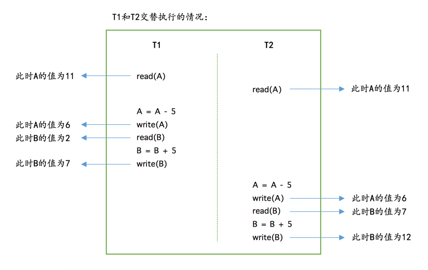
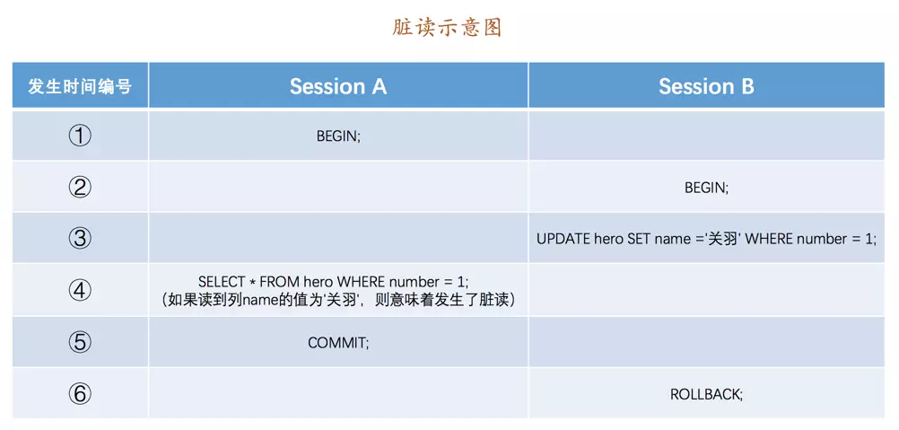
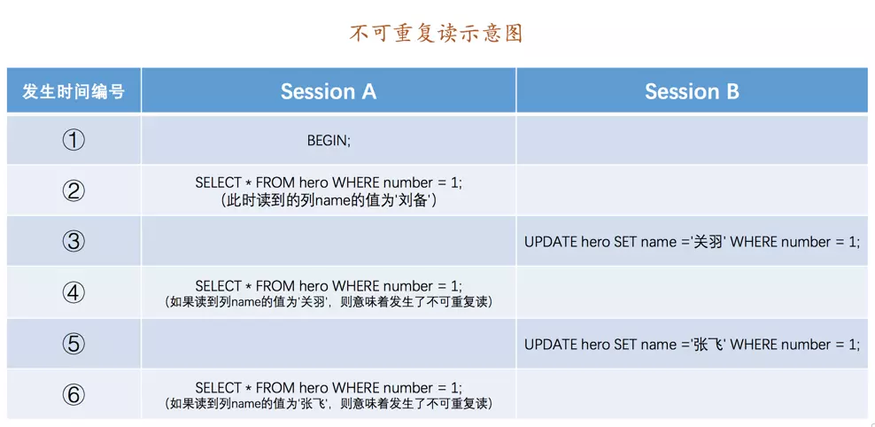
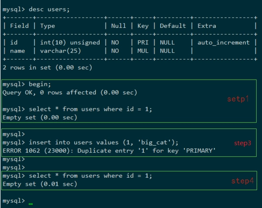
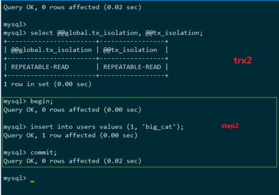

## 索引

- 每个索引都对应一棵`B+`树，`B+`树分为好多层，最下边一层是叶子节点，其余的是内节点。所有`用户记录`都存储在`B+`树的叶子节点，所有`目录项记录`都存储在内节点。

- `InnoDB`存储引擎会自动为主键（如果没有它会自动帮我们添加）建立`聚簇索引`，聚簇索引的叶子节点包含完整的用户记录。

- 我们可以为自己感兴趣的列建立`二级索引`，`二级索引`的叶子节点包含的用户记录由`索引列 + 主键`组成，所以如果想通过`二级索引`来查找完整的用户记录的话，需要通过`回表`操作，也就是在通过`二级索引`找到主键值之后再到`聚簇索引`中查找完整的用户记录。

- `B+`树中每层节点都是按照索引列值从小到大的顺序排序而组成了双向链表，而且每个页内的记录（不论是用户记录还是目录项记录）都是按照索引列的值从小到大的顺序而形成了一个单链表。如果是`联合索引`的话，则页面和记录先按照`联合索引`前边的列排序，如果该列值相同，再按照`联合索引`后边的列排序。

- 通过索引查找记录是从`B+`树的根节点开始，一层一层向下搜索。由于每个页面都按照索引列的值建立了`Page Directory`（页目录），所以在这些页面中的查找非常快。
## 索引的代价

  - 空间上的代价

    这个是显而易见的，每建立一个索引都要为它建立一棵`B+`树，每一棵`B+`树的每一个节点都是一个数据页，一个页默认会占用`16KB`的存储空间，一棵很大的`B+`树由许多数据页组成，那可是很大的一片存储空间呢。

  - 时间上的代价

    每次对表中的数据进行增、删、改操作时，都需要去修改各个`B+`树索引。而且我们讲过，`B+`树每层节点都是按照索引列的值从小到大的顺序排序而组成了双向链表。不论是叶子节点中的记录，还是内节点中的记录（也就是不论是用户记录还是目录项记录）都是按照索引列的值从小到大的顺序而形成了一个单向链表。而增、删、改操作可能会对节点和记录的排序造成破坏，所以存储引擎需要额外的时间进行一些记录移位，页面分裂、页面回收啥的操作来维护好节点和记录的排序。如果我们建了许多索引，每个索引对应的`B+`树都要进行相关的维护操作，这还能不给性能拖后腿么？
    
## 单表访问方法

#### const 常数级别的访问，代价是可以忽略不计

```mysql
 select * from user where  id = 1 ;
```

1. 主键列进行等值比较时

2. 唯一二级索引列和一个常数进行等值比较时

3. 如果主键或者唯一二级索引是由多个列构成的话，索引中的每一个列都需要与常数进行等值比较(联合唯一索引)

#### ref 普通二级索引列与常数进行等值比较

```mysql
SELECT * FROM single_table WHERE key1 = 'abc';
SELECT * FROM single_table WHERE key1 is NULL; // 也算是等值比较
SELECT * FROM single_table WHERE key_part1 = 'god like';
SELECT * FROM single_table WHERE key_part1 = 'god like' AND key_part2 = 'legendary';
```

当``single_table``表中，存在普通二级索引 ``key1``时，或存在 联合索引 ``idx_key_part1_key_part2(key_part1, key_part2)``时，则会使用ref 访问方法。

当二级索引列值为`NULL`时，无论该索引是唯一二级索引还是普通二级索引，都最多只能用 ref 访问方法。

对于联合索引来说，只要是最左边的连续索引列是与常数的等值比较就可能采用`ref`的访问方法，但是如果最左边的连续索引列并不全部是等值比较的话，它的访问方法就不能称为`ref`了。

#### ref_or_null 普通二级索引列与常数进行等值比较或NULL值比较

```mysql
SELECT * FROM single_demo WHERE key1 = 'abc' OR key1 IS NULL;
```

执行过程:

1. 先从``idx_key1`` 索引中分别定位 ``key1 = 'abc'``和``key1 is NULL`` 的连续记录，然后找到这些记录对应的``id``列的值.

2. 再从聚簇索引中根据上一步得到的一系列``id``值找到完整的用户记录.

#### range 索引范围查询

```mysql
SELECT * FROM single_table WHERE key2 IN (1438, 6328) OR (key2 >= 38 AND key2 <= 79);
```

当``single_table``表中已存在``idx_key2(key2)``的聚簇索引或者二级索引时，上面的SQL 会使用``range`` 的访问方法.其中包括单点区间和连续范围区间.

#### index  遍历二级索引记录

当``single_table``表中存在索引``idx_key_part(key_part1, key_part2, key_part3)``时：

```mysql
SELECT key_part1, key_part3，key_part2,  FROM single_table WHERE key_part2 = 'abc';
```

分析上面的sql的特点：

1. `key_part2`并不是联合索引`idx_key_part`最左索引列，所以我们无法使用`ref`或者`range`访问方法来执行这个语句

2. 它的查询列表只有3个列：`key_part1`, `key_part2`, `key_part3`，而索引`idx_key_part`又包含这三个列(查询列表是字段顺序虽然和联合索引中字段顺序不同，但是经过mysql查询优化器时，会优化这部分)

3. 搜索条件中只有`key_part2`列。这个列也包含在索引`idx_key_part`中

基于以上条件，我们发现，可以直接通过遍历`idx_key_part`索引的叶子节点的记录来比较`key_part2 = 'abc'`这个条件是否成立，把匹配成功的二级索引记录的`key_part1`, `key_part2`, `key_part3`列的值直接加到结果集中就行了。

由于二级索引记录比聚簇索记录小的多（innodb中聚簇索引记录要存储所有列的数据，而二级索引记录只需要存放索引列和主键），而且这个过程也不用进行回表操作，所以直接遍历二级索引比直接遍历聚簇索引的成本要小很多。

#### all 全表扫描

对于`InnoDB`表来说也就是直接扫描聚簇索引

## index merge 索引合并

`MySQL`在一般情况下执行一个查询时最多只会用到单个二级索引，但是在这些特殊情况下也可能在一个查询中使用到多个二级索引，设计`MySQL`的大叔把这种使用到多个索引来完成一次查询的执行方法称之为：`index merge`，具体的索引合并算法有下边三种。

#### Intersection 合并 (交集合并)

合并过程：

- 按照不同的搜索条件分别读取不同的二级索引

- 将从多个二级索引得到的主键值取交集，然后进行回表操作

适用场景：

- 多个二级索引列都是等值匹配的情况，对于联合索引来说，在联合索引中的每个列都必须等值匹配，不能出现只匹配部分列的情况

  ```mysql
  // single_table表中存在普通二级索引idx_key1(key1)和联合索引
  // idx_key_part1_key_part2_key_part3(key_part1,key_part2,key_part3)
  // 此句用到交集索引
  SELECT * FROM single_table WHERE key1 = 'a' AND key_part1 = 'a' AND key_part2 = 'b' AND key_part3 = 'c';
  
  // 下面两个SQL 用不到交集索引
  SELECT * FROM single_table WHERE key1 > 'a' AND key_part1 = 'a' AND key_part2 = 'b' AND key_part3 = 'c';
  
  SELECT * FROM single_table WHERE key1 = 'a' AND key_part1 = 'a';
  ```

- 主键列可以是范围匹配且二级索引列是等值匹配的情况

  ```mysql
  // single_table表中存在主键id和普通二级索引idx_key1(key1)
  // 此句也可用到交集索引
  SELECT * FROM single_table WHERE id > 100 AND key1 = 'a';
  ```
  注意：
        **即使情况一、情况二成立，也不一定发生Intersection索引合并，这得看优化器的心情。优化器只有在单独根据搜索条件从某个二级索引中获取的记录数太多，导致回表开销太大，而通过Intersection索引合并后需要回表的记录数大大减少时才会使用Intersection索引合并。**
#### Union合并 （并集合并）

- 二级索引列是等值匹配的情况，对于联合索引来说，在联合索引中的每个列都必须等值匹配，不能出现只出现匹配部分列的情况。

  ```mysql
  // 假设 single_table 表存在普通二级索引idx_key1(key1)和联合索引
  // idx_key_part1_key_part2_key_part3(key_part1，key_part2，key_part3)
  // 此句用到了并集合并
  SELECT * FROM single_table WHERE key1 = 'a' OR ( key_part1= 'a' AND key_part2 = 'b' AND key_part3 = 'c');
  
  // 下面两句用不到并集合并
  SELECT * FROM single_table WHERE key1 > 'a' OR (key_part1 = 'a' AND key_part2 = 'b' AND key_part3 = 'c');
  
  SELECT * FROM single_table WHERE key1 = 'a' OR key_part1 = 'a';
  // 第一个查询是因为对 key1 进行了范围匹配，第二个查询是因为联合索引 idx_key_part 中的 key_part2 // 列并没有出现在搜索条件中，所以这两个查询不能进行 Union 索引合并。
  ```

- 主键列可以是范围匹配，但是二级索引必须是等值匹配的情况，若有联合索引，则必须匹配所有列

  ```mysql
  // 假设 single_table 表存在主键id 和联合索引
  // idx_key_part1_key_part2_key_part3(key_part1，key_part2，key_part3)
  SELECT * FROM single_table WHERE id > 'a' OR (key_part1 = 'a' AND key_part2 = 'b' AND key_part3 = 'c');
  ```

- 使用`Intersection`索引合并的搜索条件

```mysql
SELECT * FROM single_table WHERE key_part1 = 'a' AND key_part2 = 'b' AND key_part3 = 'c' OR (key1 = 'a' AND key3 = 'b');
```

 上面的SQL的执行过程：

1. 先按照搜索条件`key1 = 'a' AND key3 = 'b'`从索引`idx_key1`和`idx_key3`中使用`Intersection`索引合并的方式得到一个主键集合。

2. 再按照搜索条件`key_part1 = 'a' AND key_part2 = 'b' AND key_part3 = 'c'`从联合索引`idx_key_part`中得到另一个主键集合。

3. 采用`Union`索引合并的方式把上述两个主键集合取并集，然后进行回表操作，将结果返回给用户。

**当然，查询条件符合了这些情况也不一定就会采用Union索引合并，也得看优化器的心情。优化器只有在单独根据搜索条件从某个二级索引中获取的记录数比较少，通过Union索引合并后进行访问的代价比全表扫描更小时才会使用Union索引合并。**

#### Sort-Union合并

假设single_table表中存在 ``idx_key1(key1) ``和`` idx_key3(key3)``两个普通二级索引。

```mysql
SELECT * FROM single_table WHERE key1 < 'a' OR key3 > 'z'
```

该SQL的执行过程如下：

1. 先根据`key1 < 'a'`条件从`idx_key1`二级索引中获取记录，并按照记录的主键值进行排序

2. 再根据`key3 > 'z'`条件从`idx_key3`二级索引中获取记录，并按照记录的主键值进行排序

3. 因为上述的两个二级索引主键值都是排好序的，剩下的操作和`Union`索引合并方式就一样了

上述这种先按照二级索引记录的主键值进行排序，之后按照Union索引合并方式执行的方式称之为Sort-Union索引合并，很显然，**这种Sort-Union索引合并比单纯的Union索引合并多了一步对二级索引记录的主键值排序的过程。**

   补充：
   为啥有Sort-Union索引合并，就没有Sort-Intersection索引合并么？是的，的确没有Sort-Intersection索引合并这么一说， Sort-Union的适用场景是单独根据搜索条件从某个二级索引中获取的记录数比较少，这样即使对这些二级索引记录按照主键值进行排序的成本也不会太高。而Intersection索引合并的适用场景是单独根据搜索条件从某个二级索引中获取的记录数太多，导致回表开销太大，合并后可以明显降低回表开销，但是如果加入Sort-Intersection后，就需要为大量的二级索引记录按照主键值进行排序，这个成本可能比回表查询都高了，所以也就没有引入Sort-Intersection这个玩意儿。

#### 其他

###### 联合索引替代Intersection索引合并

```mysql
// 假设single_table表中存在 两个普通二级索引 idx_key1(key1)和 idx_key3(key3)
SELECT * FROM single_table WHERE key1 = 'a' AND key3 = 'b';
```

这个查询之所以可能使用`Intersection`索引合并的方式执行，是因为`idx_key1`和`idx_key3`是两个单独的`B+`树索引，你要是把这两个列搞一个联合索引，那直接使用这个联合索引就把事情搞定了，何必用啥索引合并呢.

##  <a name="table">表连接</a>

先建立两个简单的表并给它们填充一点数据：

```mysql
mysql> CREATE TABLE t1 (m1 int, n1 char(1));
Query OK, 0 rows affected (0.02 sec)

mysql> CREATE TABLE t2 (m2 int, n2 char(1));
Query OK, 0 rows affected (0.02 sec)

mysql> INSERT INTO t1 VALUES(1, 'a'), (2, 'b'), (3, 'c');
Query OK, 3 rows affected (0.00 sec)
Records: 3  Duplicates: 0  Warnings: 0

mysql> INSERT INTO t2 VALUES(2, 'b'), (3, 'c'), (4, 'd');
Query OK, 3 rows affected (0.00 sec)
Records: 3  Duplicates: 0  Warnings: 0
```
表数据：
```mysql
mysql> SELECT * FROM t1;
+------+------+
| m1   | n1   |
+------+------+
|    1 | a    |
|    2 | b    |
|    3 | c    |
+------+------+
3 rows in set (0.00 sec)

mysql> SELECT * FROM t2;
+------+------+
| m2   | n2   |
+------+------+
|    2 | b    |
|    3 | c    |
|    4 | d    |
+------+------+
3 rows in set (0.00 sec)
```

多表连接中，第一个要查询的表（一般是最左边的表）被称为**驱动表**，其他需要连接的表称为**被驱动表**。

**连接的本质就是把各个连接表中的记录都取出来，依次匹配的组合加入结果集并返回给用户。**

**在两表连接查询中，驱动表只需要访问一次，被驱动表可能被访问多次。**

#### 内连接和外连接

先有两个表：

```mysql
CREATE TABLE student (
    number INT NOT NULL AUTO_INCREMENT COMMENT '学号',
    name VARCHAR(5) COMMENT '姓名',
    major VARCHAR(30) COMMENT '专业',
    PRIMARY KEY (number)
) Engine=InnoDB CHARSET=utf8 COMMENT '学生信息表';

CREATE TABLE score (
    number INT COMMENT '学号',
    subject VARCHAR(30) COMMENT '科目',
    score TINYINT COMMENT '成绩',
    PRIMARY KEY (number, score)
) Engine=InnoDB CHARSET=utf8 COMMENT '学生成绩表';
```
表中的数据如下：
```mysql
mysql> SELECT * FROM student;
+----------+-----------+--------------------------+
| number   | name      | major                    |
+----------+-----------+--------------------------+
| 20180101 | 杜子腾    | 软件学院                 |
| 20180102 | 范统      | 计算机科学与工程         |
| 20180103 | 史珍香    | 计算机科学与工程         |
+----------+-----------+--------------------------+
3 rows in set (0.00 sec)

mysql> SELECT * FROM score;
+----------+-----------------------------+-------+
| number   | subject                     | score |
+----------+-----------------------------+-------+
| 20180101 | 母猪的产后护理              |    78 |
| 20180101 | 论萨达姆的战争准备          |    88 |
| 20180102 | 论萨达姆的战争准备          |    98 |
| 20180102 | 母猪的产后护理              |   100 |
+----------+-----------------------------+-------+
4 rows in set (0.00 sec)
```

先查询每个学生的考试成绩：

```mysql
mysql> SELECT s1.number, s1.name, s2.subject, s2.score FROM student AS s1, score AS s2 WHERE s1.number = s2.number;
+----------+-----------+-----------------------------+-------+
| number   | name      | subject                     | score |
+----------+-----------+-----------------------------+-------+
| 20180101 | 杜子腾    | 母猪的产后护理              |    78 |
| 20180101 | 杜子腾    | 论萨达姆的战争准备          |    88 |
| 20180102 | 范统      | 论萨达姆的战争准备          |    98 |
| 20180102 | 范统      | 母猪的产后护理              |   100 |
+----------+-----------+-----------------------------+-------+
4 rows in set (0.00 sec)
```

从上述查询结果中我们可以看到，各个同学对应的各科成绩就都被查出来了，但是，`史珍香`同学，也就是学号为`20180103`的同学因为某些原因没有参加考试，所以在`score`表中没有对应的成绩记录。

那如果老师想查看所有同学的考试成绩，即使是缺考的同学也应该展示出来，那么上面的`连接查询`是无法完成这样的需求的。

我们稍微思考一下这个需求，其本质是想：**驱动表中的记录即使在被驱动表中没有匹配的记录，也仍然需要加入到结果集**。为了解决这个问题，就有了`内连接`和`外连接`的概念：

- `内连接`的两个表，驱动表中的记录在被驱动表中找不到匹配的记录，该记录不会加入到最后的结果集，上边提到的连接都是所谓的`内连接`。

- `外连接`的两个表，驱动表中的记录即使在被驱动表中没有匹配的记录，也仍然需要加入到结果集。

  外连接又可以细分为：

  - 左外连接（选取左侧的表为驱动表）。
  - 右外连接（选取右侧的表为驱动表）。

可是这样仍然存在问题，即使对于外连接来说，有时候我们也并不想把驱动表的全部记录都加入到最后的结果集。这就犯难了，有时候匹配失败要加入结果集，有时候又不要加入结果集。这时候。我们把过滤条件分为两种，让放在不同地方的过滤条件具有不同语义：

- `WHERE`子句中的过滤条件

  `WHERE`子句中的过滤条件就是我们平时见的那种，不论是内连接还是外连接，凡是不符合`WHERE`子句中的过滤条件的记录都不会被加入最后的结果集。

- `ON`子句中的过滤条件

  对于外连接的驱动表的记录来说，那些无法在被驱动表中找到匹配`ON`子句中的过滤条件的记录，仍然会被加入到结果集中，**对应的被驱动表记录的各个字段使用`NULL`值填充**。

  需要注意的是，这个`ON`子句是专门为外连接驱动表中的记录在被驱动表找不到匹配记录时，应不应该把该记录加入结果集这个场景下提出的。所以如果把`ON`子句放到内连接中，`MySQL`会把它和`WHERE`子句一样对待，也就是说：**内连接中的WHERE子句和ON子句是等价的**。

**一般情况下，我们把只涉及单表的过滤条件放到`WHERE`子句中，把涉及两表的过滤条件都放到`ON`子句中，我们也把放到`ON`子句中的过滤条件也称之为`连接条件`。**

#### 左（外）连接

左（外）连接的`SQL`语句的语法比较简单，这里不再展示。对于`LEFT JOIN`类型的连接来说，我们把放在左边的表称之为**外表**或者**驱动表**，右边的表称之为**内表**或者**被驱动表**。所以上述例子中`t1`就是外表或者驱动表，`t2`就是内表或者被驱动表。需要注意的是，**对于左（外）连接和右（外）连接来说，必须使用`ON`子句来指出连接条件**。

回到上面的例子中，把所有的学生的成绩信息都查询出来，即使是缺考的考生也应该被放到结果集中：

```mysql
mysql> SELECT s1.number, s1.name, s2.subject, s2.score FROM student AS s1 LEFT JOIN score AS s2 ON s1.number = s2.number;
+----------+-----------+-----------------------------+-------+
| number   | name      | subject                     | score |
+----------+-----------+-----------------------------+-------+
| 20180101 | 杜子腾    | 母猪的产后护理              |    78 |
| 20180101 | 杜子腾    | 论萨达姆的战争准备          |    88 |
| 20180102 | 范统      | 论萨达姆的战争准备          |    98 |
| 20180102 | 范统      | 母猪的产后护理              |   100 |
| 20180103 | 史珍香    | NULL                        |  NULL |
+----------+-----------+-----------------------------+-------+
5 rows in set (0.04 sec)
```

#### 右（外）连接

右（外）连接和左（外）连接的原理是一样一样的，语法也只是把`LEFT`换成`RIGHT`而已。**只不过驱动表是右边的表，被驱动表是左边的表。**

#### 内连接

内连接和外连接的根本区别就是，**内连接的时候，当驱动表中的记录不符合`ON`子句中的连接条件时不会把该记录加入到最后的结果集**。

对于内连接来说，凡是不符合`ON`子句或`WHERE`子句中的条件的记录都会被过滤掉，其实也就相当于从两表连接的**笛卡尔积**中把不符合过滤条件的记录给踢出去。所以，**在内连接中，驱动表和被驱动表是可以互换的，表名在SQL语句中出现的顺序并不会影响最后的查询结果。**

但是对于外连接来说，由于驱动表中的记录即使在被驱动表中找不到符合`ON`子句连接条件的记录，**该条驱动表和被驱动表组合成的记录也仍然会出现在最后的结果集中，只是被驱动表的字段值都会用Null代替**，所以此时驱动表和被驱动表的关系就很重要了，也就是说**左外连接和右外连接的驱动表和被驱动表不能轻易互换**。

## 连接的原理

#### 嵌套循环连接（Nested-Loop Join）

- 步骤1：选取驱动表，使用与驱动表相关的过滤条件，选取代价最低的单表访问方法来执行对驱动表的单表查询。
- 步骤2：对上一步骤中查询驱动表得到的结果集中每一条记录，都分别到被驱动表中查找匹配的记录。

如果有3个表进行连接的话，那么`步骤2`中得到的结果集就像是新的驱动表，然后第三个表就成为了被驱动表，重复上边过程，也就是`步骤2`中得到的结果集中的每一条记录都需要到`t3`表中找一找有没有匹配的记录，用伪代码表示一下这个过程就是这样：

```msyql
for each row in t1 {   
    #此处表示遍历满足对t1单表查询结果集中的每一条记录
    
    for each row in t2 {  
    #此处表示对于某条t1表的记录来说，遍历满足对t2单表查询结果集中的每一条记录
    
        for each row in t3 {   
        #此处表示对于某条t1和t2表的记录组合来说，对t3表进行单表查询
        
            if （row satisfies join conditions） {
             	send to client
             ｝
        }
    }
}
```

这个过程就像是一个嵌套的循环，所以这种驱动表只访问一次，但被驱动表却可能被多次访问，**访问次数取决于对驱动表执行单表查询后的结果集中的记录条数的连接**执行方式称之为**嵌套循环连接（Nested-Loop Join）**，这是最简单，也是最笨拙的一种连接查询算法。

#### 使用索引加快连接速度

```mysql
SELECT * FROM t1, t2 WHERE t1.m1 > 1 AND t1.m1 = t2.m2 AND t2.n2 < 'd';
```

`t1` 和` t2 `的表结构在 <a href="#table">这里</a>

在上面的查询中，查询驱动表`t1`后的结果集中有2条记录，`嵌套循环连接`算法需要对被驱动表查询2次:

- 当`t1.m1 = 2`时，去查询一遍`t2`表，对`t2`表的查询语句相当于：

  ```
  SELECT * FROM t2 WHERE t2.m2 = 2 AND t2.n2 < 'd';
  ```

- 当`t1.m1 = 3`时，再去查询一遍`t2`表，此时对`t2`表的查询语句相当于：

  ```
  SELECT * FROM t2 WHERE t2.m2 = 3 AND t2.n2 < 'd';
  ```

可以看到，原来的`t1.m1 = t2.m2`这个涉及两个表的过滤条件在针对`t2`表做查询时, 关于`t1`表的条件就已经确定了，所以我们只需要单单优化对`t2`表的查询了，上述两个对`t2`表的查询语句中利用到的列是`m2`和`n2`列，我们可以：

- 在`m2`列上建立索引，因为对`m2`列的条件是等值查找，比如`t2.m2 = 2`、`t2.m2 = 3`等，所以可能使用到`ref`的访问方法，假设使用`ref`的访问方法去执行对`t2`表的查询的话，需要回表之后再判断`t2.n2 < d`这个条件是否成立。

  假设`m2`列是`t2`表的主键或者唯一二级索引列，那么使用`t2.m2 = 常数值`这样的条件从`t2`表中查找记录的过程的代价就是常数级别的。也就是用到`const`访问方法。

- 在`n2`列上建立索引，涉及到的条件是`t2.n2 < 'd'`，可能用到`range`的访问方法，假设使用`range`的访问方法对`t2`表的查询的话，需要回表之后再判断在`m2`列上的条件是否成立。

假设`m2`和`n2`列上都存在索引的话，那么就需要从这两个里边儿挑一个代价更低的去执行对`t2`表的查询。当然，建立了索引不一定使用索引，只有在**二级索引 + 回表的代价比全表扫描的代价更低时**才会使用索引。

#### 基于块的嵌套循环连接（Block Nested-Loop Join）

当被驱动表中的数据非常多时（几百万、几千万或者几亿条），使用嵌套循环连接，先从驱动表中取出一条记录，然后把被驱动表的记录加载到内存中，然后让驱动表结果集的这一条记录和在内存中被驱动表的每一条记录匹配，之后就会被从内存中清除掉。然后再从驱动表结果集中拿出另一条记录，再一次把被驱动表的记录加载到内存中一遍，周而复始，驱动表结果集中有多少条记录，就得把被驱动表从磁盘上加载到内存中多少次。如果这个被驱动表中的数据特别多而且不能使用索引进行访问，那就相当于要从磁盘上读好几次这个表，这个`I/O`代价就非常大了。

如果我们可以在把被驱动表的记录加载到内存的时候，一次性和多条驱动表中的记录做匹配，这样就可以大大减少重复从磁盘上加载被驱动表的代价了。所以设计`MySQL`的大叔提出了一个**join buffer**的概念，`join buffer`就是执行连接查询前申请的一块固定大小的内存，先把若干条驱动表结果集中的记录装在这个`join buffer`中，然后开始扫描被驱动表，每一条被驱动表的记录一次性和`join buffer`中的多条驱动表记录做匹配，因为匹配的过程都是在内存中完成的，所以这样可以显著减少被驱动表的`I/O`代价。

最好的情况是`join buffer`足够大，能容纳驱动表结果集中的所有记录，这样只需要访问一次被驱动表就可以完成连接操作了。设计`MySQL`的大叔把这种加入了`join buffer`的嵌套循环连接算法称之为**基于块的嵌套循环连接**（Block Nested-Loop Join）算法。

这个`join buffer`的大小是可以通过启动参数或者系统变量`join_buffer_size`进行配置，默认大小为`262144字节`（也就是`256KB`），最小可以设置为`128字节`。当然，对于优化被驱动表的查询来说，最好是为被驱动表加上效率高的索引，如果实在不能使用索引，并且自己的机器的内存也比较大可以尝试调大`join_buffer_size`的值来对连接查询进行优化。

另外需要注意的是，驱动表的记录**并不是所有列都会被放到`join buffer`中**，只有**查询列表中的列和过滤条件中的列**才会被放到`join buffer`中，所以提醒我们，最好不要`select * `，只需要把我们关心的列放到查询列表就好了，这样就可以在`join buffer`中放置更多的记录。

## 事务简介

#### 事务的起源

银行账户表：
```mysql
CREATE TABLE account (
    id INT NOT NULL AUTO_INCREMENT COMMENT '自增id',
    name VARCHAR(100) COMMENT '客户名称',
    balance INT COMMENT '余额',
    PRIMARY KEY (id)
) Engine=InnoDB CHARSET=utf8;
```
狗哥和猫爷是一对好基友，他们都到银行开一个账户，他们在现实世界中拥有的资产就会体现在数据库世界的account表中。比如现在狗哥有11元，猫爷只有2元，那么现实中的这个情况映射到数据库的account表就是这样：

```mysql
+----+--------+---------+
| id | name   | balance |
+----+--------+---------+
|  1 | 狗哥   |      11 |
|  2 | 猫爷   |       2 |
+----+--------+---------+
```

狗哥给猫爷转账：

```mysql
UPDATE account SET balance = balance - 10 WHERE id = 1;
UPDATE account SET balance = balance + 10 WHERE id = 2;
```

以上操作可能会出现转账失败的几种情况：

- 第一条执行成功后，第二条还没有开始执行时，忽然服务器断电了。把狗哥的钱扣了，但是没给猫爷转过去。

-  即使只执行一条语句，执行这个语句前，先把这条记录所在的页面加载到`Buffer Pool`中，然后修改了这个页面，此时并不立即把修改同步到磁盘，而只是把这个修改了的页面加到`Buffer Pool`的`flush链表`中，在之后的某个时间点再刷新到磁盘。如果在将修改过的页刷新到磁盘之前系统崩溃了。

- 或者在刷新磁盘的过程中（只刷新部分数据到磁盘上），系统奔溃了。

#### 原子性（Atomicity）

现实世界中转账操作是**一个不可分割的操作**，也就是说要么压根儿就没转，要么转账成功，不能存在中间的状态，也就是转了一半的这种情况。设计数据库的大叔们把这种**要么全执行，要么全不执行**的规则称之为`原子性`。

但是在现实世界中的**一个不可分割的操作却可能对应着数据库世界若干条不同的操作，数据库中的一条操作也可能被分解成若干个步骤**（比如先修改缓存页，之后再刷新到磁盘等），最要命的是**在任何一个可能的时间都可能发生意想不到的错误（可能是数据库本身的错误，或者是操作系统错误，甚至是直接断电之类的）**而使操作执行不下去，导致转账操作出现失败。

#### 隔离性（Isolation）

现实世界中的两次状态转换应该是互不影响的，比如说狗哥向猫爷同时进行的两次金额为5元的转账（假设可以在两个ATM机上同时操作）。那么最后狗哥的账户里肯定会少10元，猫爷的账户里肯定多了10元。但是到对应的数据库世界中，事情又变的复杂了一些。为了简化问题，我们粗略的假设狗哥向猫爷转账5元的过程是由下边几个步骤组成的：

- 步骤一：读取狗哥账户的余额到变量A中，这一步骤简写为`read(A)`。
- 步骤二：将狗哥账户的余额减去转账金额，这一步骤简写为`A = A - 5`。
- 步骤三：将狗哥账户修改过的余额写到磁盘里，这一步骤简写为`write(A)`。
- 步骤四：读取猫爷账户的余额到变量B，这一步骤简写为`read(B)`。
- 步骤五：将猫爷账户的余额加上转账金额，这一步骤简写为`B = B + 5`。
- 步骤六：将猫爷账户修改过的余额写到磁盘里，这一步骤简写为`write(B)`。

我们将狗哥向猫爷同时进行的两次转账操作分别称为`T1`和`T2`，在现实世界中`T1`和`T2`是应该没有关系的，可以先执行完`T1`，再执行`T2`，或者先执行完`T2`，再执行`T1`.

但是很不幸，真实的数据库中`T1`和`T2`的操作可能交替执行，比如这样：



如果按照上图中的执行顺序来进行两次转账的话，最终狗哥的账户里还剩`6`元钱，相当于只扣了5元钱，但是猫爷的账户里却成了`12`元钱，相当于多了10元钱，银行吃亏了！

因此，对于现实世界中状态转换对应的某些数据库操作来说，不仅要保证这些操作以`原子性`的方式执行完成，而且要保证**其它的状态转换不会影响到本次状态转换**，这个规则被称之为`隔离性`。

#### 一致性（Consistency）

我们生活的这个世界存在着形形色色的约束，比如身份证号不能重复，性别只能是男或者女，高考的分数只能在0～750之间。只有符合这些约束的数据才是有效的，如果**数据库中的数据全部符合现实世界中的约束**（all defined rules），我们说这些数据就是一致的，或者说符合`一致性`的。

如何保证数据库中数据的一致性（就是符合所有现实世界的约束）呢？这其实靠两方面的努力：

- 数据库本身能为我们保证一部分一致性需求（就是数据库自身可以保证一部分现实世界的约束永远有效）。

  `MySQL`数据库已经提供了**主键约束、唯一索引约束、外键约束、NOT NULL约束**（声明某个列为`NOT NULL`来拒绝`NULL`值的插入）。

  除此之外，`MySQL`还支持`CHECK`语法来自定义约束，比如这样：

  ```mysql
  CREATE TABLE account (
      id INT NOT NULL AUTO_INCREMENT COMMENT '自增id',
      name VARCHAR(100) COMMENT '客户名称',
      balance INT COMMENT '余额',
      PRIMARY KEY (id),
      CHECK (balance >= 0) 
  );
  ```

  上述例子中的`CHECK`语句本意是想规定`balance`列不能存储小于0的数字，对应的现实世界的意思就是银行账户余额不能小于0。但是很遗憾，**MySQL仅仅支持CHECK语法，但实际上并没有一点卵用。**也就是说上面的sql虽然不会报错，但是`CHECK (balance >= 0) `仍然是没用的，`account`表的`balance ` 字段的值仍然可以为负值。但是我们还是可以通过**定义触发器的方式**来自定义一些约束条件以保证数据库中数据的一致性。

- 更多的一致性需求需要靠写业务代码的程序员自己保证。

  比方说我们的`account`表，我们也可以不建立触发器，只要编写业务的程序员在自己的业务代码里判断一下，当某个操作会将`balance`列的值更新为小于0的值时，就不执行该操作就好了。

​        前边提到的`原子性`和`隔离性`都会对`一致性`产生影响，比如我们现实世界中转账操作完成后，有一个`一致性`需求就是**参与转账的账户的总的余额是不变的**。如果数据库不遵循`原子性`要求，也就是转了一半就不转了，也就是说给狗哥扣了钱而没给猫爷转过去，那最后就是不符合一致性需求的；类似的，如果数据库不遵循`隔离性`要求，就像我们前边唠叨`隔离性`时举的例子中所说的，最终狗哥账户中扣的钱和猫爷账户中涨的钱可能就不一样了，也就是说不符合`一致性`需求了。

​        所以说，**数据库某些操作的原子性和隔离性都是保证一致性的一种手段**，在操作执行完成后保证符合所有既定的约束则是一种结果。但是满足`原子性`和`隔离性`的操作也不一定就满足`一致性`，比如说狗哥要转账20元给猫爷，虽然在满足`原子性`和`隔离性`，但转账完成了之后狗哥的账户的余额就成负的了，这显然是不满足`一致性`的。

#### 持久性（Durability）
当现实世界的一个状态转换完成后，这个转换的结果将永久的保留，这个规则被设计数据库的大叔们称为持久性。比方说狗哥向猫爷转账，当ATM机提示转账成功了，就意味着这次账户的状态转换完成了，狗哥就可以拔卡走人了。如果当狗哥走掉之后，银行又把这次转账操作给撤销掉，恢复到没转账之前的样子，那猫爷还是没有钱。。。。。。所以这个持久性是非常重要的。

对于数据库，持久性意味着**对数据库的写操作都应该在磁盘上保留下来**，不论之后发生了什么事故，本次写操作造成的影响都不应该被丢失掉。

#### 事务的概念

我们把`原子性`（`Atomicity`）、`隔离性`（`Isolation`）、`一致性`（`Consistency`）和`持久性`（`Durability`）这四个词对应的英文单词首字母提取出来就是`A`、`I`、`C`、`D`，稍微变换一下顺序可以组成一个完整的英文单词：`ACID`。`ACID`是英文`酸`的意思。设计数据库的大叔为了方便起见，**把需要保证`原子性`、`隔离性`、`一致性`和`持久性`的一个或多个数据库操作称之为一个`事务`**。

事务的英文是transaction，英文直译就是交易，买卖的意思，交易就是买的人付钱，卖的人交货，不能付了钱不交货，交了货不付钱把，所以交易本身就是一种不可分割的操作。

`MySQL`中并不是所有存储引擎都支持事务的功能，目前只有`InnoDB`和`NDB`存储引擎支持，如果某个事务中包含了修改使用不支持事务的存储引擎的表，那么对该使用不支持事务的存储引擎的表所做的修改将无法进行回滚。

默认情况下，如果我们不显式的使用`START TRANSACTION`或者`BEGIN`语句开启一个事务，那么每一条语句都算是一个独立的事务，这种特性称之为事务的`自动提交`。

也就是说，下边这两条语句就相当于放到两个独立的事务中去执行：

```mysql
UPDATE account SET balance = balance - 10 WHERE id = 1;
UPDATE account SET balance = balance + 10 WHERE id = 2;
```

显式的的使用`START TRANSACTION`或者`BEGIN`语句开启一个事务或者把系统变量`autocommit`的值设置为`OFF`，就像这样：`SET autocommit = OFF;`，都可以关闭这种`自动提交`的功能。

#### 隔离性引发的4个问题

- 脏写：如果一个事务修改了另一个未提交事务修改过的数据, 那就意味着发生了`脏写`，

  

  ```mysql
  /* 如上图，Session A 和 Session B 各开启了一个事务， Session B 中的事务先将 number 列为 1 的记录的 name 列更新为 '关羽' ，然后 Session A 中的事务接着又把这条 number 列为 1 的记录的 name 列更新为 '张飞'。如果之后 Session B 中的事务进行了回滚，那么 Session A 中的更新也将不复存在，这种现象就称之为`脏写`。这时 Session A 中的事务就很懵逼，我明明把数据更新了，最后也提交事务了，怎么到最后说自己啥也没干呢？ */
  ```
  
- 脏读：如果一个事务读到了另一个未提交事务修改过的数据，那就意味着发生了`脏读`.
  
  
  
  
  
  ```mysql
  /* 如上图，Session A和Session B各开启了一个事务，Session B中的事务先将number列为1的记录的name列更新为'关羽'，然后Session A中的事务再去查询这条number为1的记录，如果du到列name的值为'关羽'，而Session B中的事务稍后进行了回滚，那么Session A中的事务相当于读到了一个不存在的数据，这种现象就称之为脏读。*/
  ```
  
- 不可重复读：如果一个事务只能读到另一个已经提交的事务修改过的数据，并且其他事务每对该数据进行一次修改并提交后，该事务都能查询得到最新值，那就意味着发生了`不可重复读`，示意图如下：
  
  
  ```mysql
  /* 如上图，我们在Session B中提交了几个隐式事务（注意是隐式事务，意味着语句结束事务就提交了），这些事务都修改了number列为1的记录的列name的值，每次事务提交之后，如果Session A中的事务都可以查看到最新的值，这种现象也被称之为不可重复读。*/
  ```
  
- 幻读： 并不是说两次读取获取的结果集不同，幻读侧重的方面是某一次的 select 操作得到的结果所表征的数据状态无法支撑后续的业务操作。更为具体一些：select 某记录是否存在，不存在，准备插入此记录，但执行 insert 时发现此记录已存在，无法插入，此时就发生了幻读。

  

  

  ```mysql
  /* 在 RR 隔离级别下，step1、step2 是会正常执行的，step3 则会报错主键冲突，对于 T1 的业务来说是执行失败的，这里 T1 就是发生了**幻读**，因为 T1 在 step1 中读取的数据状态并不能支撑后续的业务操作，T1：“见鬼了，我刚才读到的结果应该可以支持我这样操作才对啊，为什么现在不可以”。T1 不敢相信的又执行了 step4，发现和 setp1 读取的结果是一样的（RR下的 MMVC机制）。此时，幻读无疑已经发生，T1 无论读取多少次，都查不到 id = 1 的记录，但它的确无法插入这条他通过读取来认定不存在的记录（此数据已被T2插入），对于 T1 来说，它幻读了。*/
  ```

#### Spring中5个事务隔离级别


 级别                                              | 描述                                                         
 ------------------------------------------------- | ------------------------------------------------------------ 
 ISOLATION_<font color=red>DEFAULT</font>          | 这是一个默认的隔离级别，使用数据库默认的事务隔离级别         
 ISOLATION_<font color=red>READ_UNCOMMITTED</font> | 这是事务最低的隔离级别，它充许别外一个事务可以看到这个事务未提交的数据。这种隔离级别会产生脏读，不可重复读和幻像读 
 ISOLATION_<font color=red>READ_COMMITTED</font>   | 保证一个事务修改的数据提交后才能被另外一个事务读取。另外一个事务不能读取该事务未提交的数据。这种事务隔离级别可以避免脏读出现，但是可能会出现不可重复读和幻像读 
 ISOLATION_<font color=red>REPEATABLE_READ</font>  | 这种事务隔离级别可以防止脏读，不可重复读。但是可能出现幻像读。它除了保证一个事务不能读取另一个事务未提交的数据外，还保证了避免下面的情况产生(不可重复读) 
 ISOLATION_<font color=red>SERIALIZABLE</font>     | 这是花费最高代价但是最可靠的事务隔离级别。事务被处理为顺序执行。除了防止脏读，不可重复读外，还避免了幻像读 

#### Spring中7个事务传播行为


|名称|描述|
|---|---|
|PROPAGATION_<font color=red>REQUIRED</font>|默认的spring事务传播级别，使用该级别的特点是，如果上下文中已经存在事务，那么就加入到事务中执行，如果当前上下文中不存在事务，则新建事务执行。所以这个级别通常能满足处理大多数的业务场景|
|PROPAGATION_<font color=red>SUPPORTS</font>|supports，支持，该传播级别的特点是，如果上下文存在事务，则支持事务加入事务，如果没有事务，则使用非事务的方式执行。所以说，并非所有的包在transactionTemplate.execute中的代码都会有事务支持。这个通常是用来处理那些并非原子性的非核心业务逻辑操作。应用场景较少。|
|PROPAGATION_<font color=red>MANDATORY</font>|该级别的事务要求上下文中必须要存在事务，否则就会抛出异常！配置该方式的传播级别是有效的控制上下文调用代码遗漏添加事务控制的保证手段。比如一段代码不能单独被调用执行，但是一旦被调用，就必须有事务包含的情况，就可以使用这个传播级别。|
|PROPAGATION_<font color=red>REQUIRES_NEW</font>|new，每次都要一个新事务，该传播级别的特点是，每次都会新建一个事务，并且同时将上下文中的事务挂起，执行当前新建事务完成以后，上下文事务恢复再执行|
|PROPAGATION_<font color=red>NOT_SUPPORTED</font>|not supported ，不支持，当前级别的特点就是上下文中存在事务，则挂起事务，执行当前逻辑，结束后恢复上下文的事务。|
|PROPAGATION_<font color=red>NEVER</font>|该事务更严格，上面一个事务传播级别只是不支持而已，有事务就挂起，而PROPAGATION_NEVER传播级别要求上下文中不能存在事务，一旦有事务，就抛出runtime异常，强制停止执行！这个级别上辈子跟事务有仇。|
|PROPAGATION_<font color=red>NESTED</font>|nested，嵌套级别事务。该传播级别特征是，如果上下文中存在事务，则嵌套事务执行，如果不存在事务，则新建事务。|

#### 嵌套事务

子事务套在父事务中执行，子事务是父事务的一部分，在进入子事务之前，父事务建立一个回滚点，叫save point，然后执行子事务，这个子事务的执行也算是父事务的一部分，然后子事务执行结束，父事务继续执行。重点就在于那个save point。

#### 锁

在多个未提交事务相继对一条记录做改动时，需要让它们排队执行，这个排队的过程其实是通过`锁`来实现的。这个所谓的`锁`其实是一个内存中的结构，在事务执行前本来是没有锁的，也就是说一开始是没有`锁结构`和记录进行关联的.

看下面的例子：

1. 事务`T1`改动了某条记录后，就生成了一个`锁结构`与该记录关联，因为之前没有别的事务为这条记录加锁，所以当前事务不需要等待，而是直接修改该条记录，我们把这个场景就称之为获取锁成功，或者加锁成功，然后就可以继续执行操作了。
2. 在事务`T1`提交之前，另一个事务`T2`也想对该记录做改动，那么先去看看有没有`锁结构`与这条记录关联，发现有一个`锁结构`与之关联后，然后也生成了一个`锁结构`与这条记录关联，不过`锁结构`的`is_waiting`属性值为`true`，表示当前事务需要等待，我们把这个场景就称之为获取锁失败，或者加锁失败，或者没有成功的获取到锁。
3. 在事务`T1`提交之后，就会把该事务生成的`锁结构`释放掉，然后看看还有没有别的事务在等待获取锁，发现了事务`T2`还在等待获取锁，所以把事务`T2`对应的锁结构的`is_waiting`属性设置为`false`，然后把该事务对应的线程唤醒，让它继续执行，此时事务`T2`就算获取到锁了。
##### 锁的类型：
- 共享锁，英文名：`Shared Locks`，简称`S锁`。在事务要读取一条记录时，需要先获取该记录的`S锁`。
- 独占锁，也常称`排他锁`，英文名：`Exclusive Locks`，简称`X锁`。在事务要改动一条记录时，需要先获取该记录的`X锁`。
##### 锁的种类：
- 行锁，对一条记录加锁，行锁可以分为共享锁（S锁）和独占锁（X锁）
- 表锁，在表级别进行加锁，表加的锁也可以分为共享锁（S锁）和独占锁（X锁）